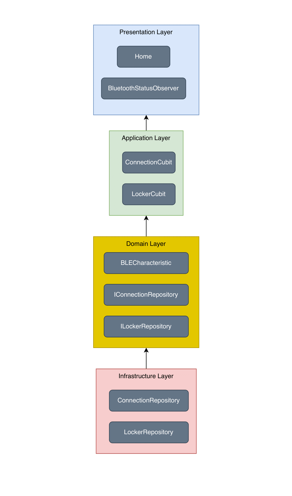
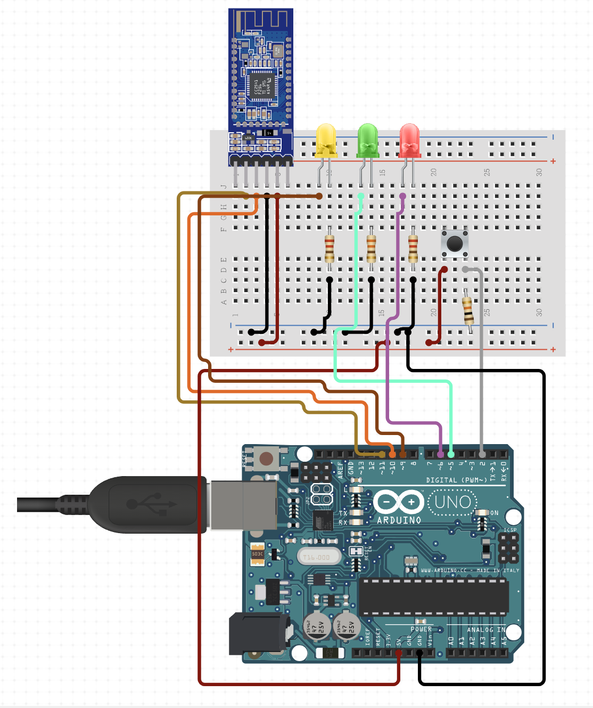

# Flutter to Arduino via Bluetooth

This project demonstrates how to connect a Flutter application to an Arduino via Bluetooth using the HM-10 module.

## Table of Contents
- [Introduction](#introduction)
- [Preview](#preview)
- [Project File Structure](#project-file-structure)
- [Arduino Circuit](#arduino-circuit)

## Introduction

This project demonstrates how to connect a Flutter application to an Arduino via Bluetooth using the HM-10 module.

## Preview

## Project File Structure

You can download and view the project file structure:
.

## Arduino Circuit

Below is the image of the Arduino circuit used in this project.

